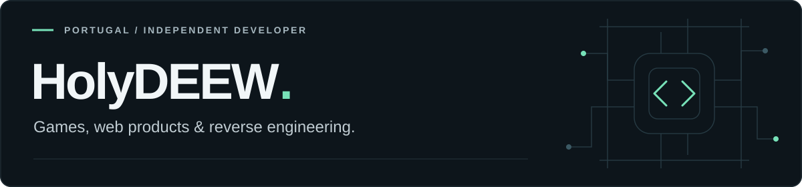

  

I'm a developer from Portugal. I build games, Android apps and web products, and reverse engineer MMORPGs and other online games.

I started at 16, running Lineage II private servers. That turned into years of working on emulators, fixing crashes, building tools and looking after live communities. These days, I split my time between that work and products of my own.

### What I'm building

<table>
<tr>
<td width="50%" valign="top">
<h3><a href="https://guardiaosos.com/">Guardião SOS</a></h3>

<strong>Creator & developer · Android</strong>

An experimental safety app for possible falls and road accidents. Detection runs on the phone, with a cancellable countdown before an automatic SOS text.

</td>
<td width="50%" valign="top">
<h3><a href="https://hellshooter.com/">Hell-Shooter</a></h3>

<strong>Creator & developer · Multiplayer game</strong>

A 2D online shooter for Windows, with tactical bots, destructible cover and its own launcher. My move from working on existing games to building one of my own.

</td>
</tr>
<tr>
<td width="50%" valign="top">
<h3><a href="https://ihostnexus.com/">iHostNexus</a></h3>

<strong>Founder & developer · Web platform</strong>

Property operations, check-ins, keys, teams, service bookings and payments. I build and maintain the platform, from the backend to the screens people use every day.

</td>
<td width="50%" valign="top">
<h3><a href="https://maisestetica.com/">Mais Estética</a></h3>

<strong>Website developer · Client work</strong>

The website for a beauty and wellness business in Lagos, with treatment information and online appointments connected to iHostNexus.

</td>
</tr>
</table>

### Game servers & reverse engineering

My work with Lineage II later led me to WoW and **[Hellgarve / WoWHellGarve](https://wowhellgarve.com/)**. I'm its founder and main developer, working on WoW emulation, custom systems, databases, launchers and the day-to-day work of keeping servers running.

I also work on **SPP WoW Single Player Project** and **KyrianCORE / Shadowlands**: debugging server behaviour, investigating crashes, testing fixes and making local builds easier to run.

My reverse engineering work covers MMORPGs and games such as **Rise of Kingdoms**. I use runtime instrumentation, memory analysis and protocol research to understand how things work, then turn that research into tools and documentation.

**[RoK Stats Hub](https://github.com/WoWHellgarve-HolyDeeW/Rok-stats-titlebot)** brings that work together: a Frida runtime, scanners, title-management tooling and a stats dashboard built with FastAPI and Next.js. The repository includes the research behind it.

### A few public projects

| Project | What it's for |
| :--- | :--- |
| [RoK Stats Hub](https://github.com/WoWHellgarve-HolyDeeW/Rok-stats-titlebot) | Rise of Kingdoms tooling, dashboard and reverse engineering notes. |
| [mod-multi-vendor](https://github.com/WoWHellgarve-HolyDeeW/mod-multi-vendor) | A multi-vendor module for AzerothCore and WoWHellGarve WotLK. |
| [holyconnect](https://github.com/WoWHellgarve-HolyDeeW/holyconnect) | USB tethering tools for Pi-Star / MMDVM hotspots. |
| [Kayak Adventures Lagos](https://kayakadventureslagos.com/) · [code](https://github.com/WoWHellgarve-HolyDeeW/kayakadventureslagos) | Website work for a local tourism business. |

### Open-source contributions

Some of my work has been merged into [AzerothCore's anticheat module](https://github.com/azerothcore/mod-anticheat): battleground adjustments for [Alterac Valley — Alliance](https://github.com/azerothcore/mod-anticheat/pull/97), [Alterac Valley — Horde](https://github.com/azerothcore/mod-anticheat/pull/98) and [Warsong Gulch](https://github.com/azerothcore/mod-anticheat/pull/99), plus a [Portuguese README](https://github.com/azerothcore/mod-anticheat/pull/96). These contributions are under my earlier account, **@holydeew**.

### Tools I work with

**Code** · C++ · C# · Python · TypeScript · JavaScript · PHP 
**Web & data** · Next.js · Node.js · FastAPI · MySQL · PostgreSQL · Redis 
**Systems & research** · Linux · Windows Server · Docker · Frida · AzerothCore · TrinityCore

<strong>Earlier work & background</strong>

 

I also led **CritiKlan**, a Call of Duty 2 clan in the ClanBase days. The team appears as **critiKlan.CoD²** in a [2007 Iberian Cup registration report](https://cod2.gamersmafia.com/noticias/23011), one of the surviving records from that time.

My Lineage II work included networking, account panels, rankings, databases and community support. [L2Hellgarve's 2018 archive](https://web.archive.org/web/20180401122354/http://www.l2hellgarve.com/) is one surviving record of that work.

More of my older work lives on [@holydeew](https://github.com/holydeew), including [TrinityCore custom changes](https://github.com/holydeew/TrinityCoreCustomChanges) and [WoWHellgarve Legion](https://github.com/holydeew/WoWHellgarve-Legion). I've also worked on Android experiments, including OctuposAI, which was previously published on Google Play.

This account also holds forks of emulator projects and AzerothCore modules I've worked with over the years. They sit alongside my own tools and projects.

Outside software, Hellgarve was also part of my music background. There's an [old article about Holydeew, Hellgarve and FNAC Faro](https://amusicaportuguesa.blogs.sapo.pt/hip-hop-na-fnac-faro-com-hellgarve-2197770).

---

[Hellgarve](https://wowhellgarve.com/) · [SPP community](https://discord.com/invite/single-player-project-291115666097045506) · [KyrianCORE](https://github.com/coolzoom/KyrianCORE-OpenSource) · [YouTube](https://www.youtube.com/@wowhellgarve) · [Earlier GitHub](https://github.com/holydeew)
